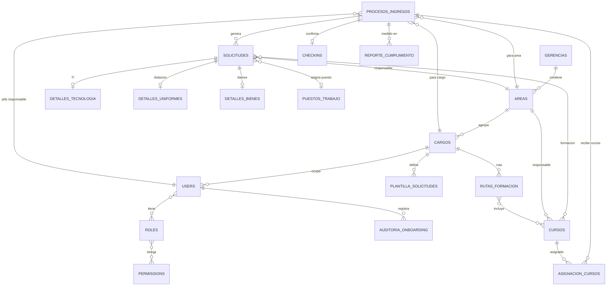

# 🏦 Sistema de Onboarding - Sinergia Cooperativa

## 📋 Descripción General

Sistema integral de gestión de procesos de ingreso de nuevos empleados para Sinergia, una cooperativa financiera solidaria. El sistema automatiza y coordina:

- ✅ Procesos de ingreso de nuevos empleados
- ✅ Solicitudes de asignación de recursos (tecnología, uniformes, bienes)
- ✅ Asignación de cursos de formación (31 cursos disponibles)
- ✅ Check-in de activos y reportes de cumplimiento

## 🏗️ Estructura Organizacional

```
Asamblea de Socios (fuera del sistema)
└─ Gerencia General (GG)
   ├─ Gerencia Administración (GA)
   │  ├─ Servicios Generales
   │  └─ Mantenimiento
   ├─ Gerencia Comercial (GC)
   │  ├─ Ventas y Captación
   │  ├─ Gestión de Canales
   │  ├─ Marketing y Producto
   │  └─ Servicio al Cliente
   ├─ Gerencia Riesgo y Crédito (GRC)
   │  ├─ Análisis de Crédito
   │  └─ Riesgo Operativo
   ├─ Gerencia Financiera (GF)
   │  ├─ Tesorería
   │  ├─ Contabilidad
   │  └─ Planeación
   ├─ Gerencia TI (GTI)
   │  ├─ Infraestructura y Redes
   │  ├─ Desarrollo de Software
   │  └─ Soporte Técnico
   └─ Gerencia Talento Humano (GTH)
      ├─ Selección y Reclutamiento
      ├─ Formación y Capacitación
      ├─ Nómina
      └─ Clima Organizacional
```

**Estructura:** 7 Gerencias (incluye Gerencia General) → areas y cargos segun BD

## 🗄️ Base de Datos (29 tablas)

Tablas principales organizadas en layers:

| Layer | Tabla | Propósito | Registros |
|-------|-------|-----------|-----------|
| **Organizacional** | `gerencias` | Niveles ejecutivos | 7 |
| | `areas` | Departamentos | 25 |
| | `cargos` | Posiciones corporativas | 58 |
| | `users` | Personas reales | Variable |
| **Onboarding** | `procesos_ingresos` | Flujo de ingreso | Variable |
| | `solicitudes` | Solicitudes por área | Variable |
| | `plantilla_solicitudes` | Plantillas por cargo | 270 |
| | `detalles_tecnologia` | Equipos TI | Variable |
| | `detalles_uniformes` | Dotación | Variable |
| | `detalles_bienes` | Materiales | Variable |
| **Infraestructura** | `puestos_trabajo` | Puestos físicos | 48 |
| **Formación** | `cursos` | Catálogo de cursos | 31 |
| | `asignacion_cursos` | Cursos asignados | Variable |
| | `rutas_formacion` | Planes de desarrollo | Variable |
| | `ruta_x_curso` | Cursos por ruta | Variable |
| **Control** | `checkins` | Confirmación de entrega | Variable |
| | `auditoria_onboarding` | Registro de acciones | Variable |
| | `reporte_cumplimiento` | Métricas | Variable |
| **Seguridad** | `roles` | Roles del sistema | 6 |
| | `permissions` | Permisos | 34 |

## 🧩 Modelo E-R



## 👥 Modelos Eloquent

**Estructura de Herencia:**
```
Gerencia (1:N)
 └─ Area (1:N)
     └─ Cargo (1:N)
         └─ User (Persona real)
             ├─ ProcesoIngreso
             ├─ Solicitudes
             └─ Roles (RBAC - Independiente)
```

## 🔐 Roles y Acceso (RBAC)

| Rol | Acceso | Responsabilidades |
|-----|--------|-------------------|
| **Root** | Sistema completo | Configuracion general y auditoria |
| **Jefe RRHH** | Procesos de ingreso | Crear/editar/cancelar procesos |
| **Jefe Tecnologia** | Solicitudes TI | Requerimientos tecnicos |
| **Jefe Dotacion** | Solicitudes Dotacion | Tallas y dotacion |
| **Jefe Servicios Generales** | Solicitudes SG | Puestos de trabajo |
| **Jefe Bienes y Servicios** | Solicitudes Bienes | Insumos y mobiliario |
| **Operador** | Su area | Completar solicitudes |

## 📦 31 Cursos Disponibles

El jefe de RRHH selecciona cursos al crear un proceso de ingreso:

```
Cultura y Compliance:
1. Inducción a la Cultura Cooperativa
2. Prevención de Lavado de Activos (SARLAFT)
3. Seguridad y Salud en el Trabajo (SST)
4. Protección de Datos Personales

Operacional:
5. Portafolio de Productos y Servicios
20. Manejo del Core Financiero (Software)
26. Protocolo de Servicio al Cliente

Técnico:
19. Ciberseguridad para No Técnicos
... (20 cursos más)
```

**Selección:** Checkboxes donde el jefe marca qué cursos asignar por cargo

## 🚀 5 Módulos Principales

### 1️⃣ Administración de Procesos de Ingreso
- Crear registro (codigo autogenerado)
- Generar solicitudes automaticas
- Editar/cancelar (condiciones)
- Historico de ingresos

**Campos obligatorios:**
- Nombre completo
- Documento y tipo
- Cargo a ocupar
- Área asignada
- Fecha ingreso
- Jefe inmediato (derivado del cargo)

### 2️⃣ Solicitudes por Área
Panel para cada área (TI, Uniformes, Mantenimiento, etc.)

**Solicitudes generadas automáticamente:**
- **Dotación:** Uniformes + EPP
- **Tecnología:** Credenciales + Hardware
- **Servicios Generales:** Puesto físico + Carnetización
- **Formación:** Inducción + Plan capacitación
- **Bienes:** Inmobiliario + Insumos

**Estados:** Pendiente → En Proceso → Finalizada

### 3️⃣ Asignación de Cursos
Jefe RRHH selecciona cursos disponibles (31 opciones)
- Presenta checkboxes
- Por cargo (ej: "Analista Programador" → sugiere kit estándar)
- Envía notificaciones vía email

### 4️⃣ Check-in de Activos (similar a aerolinea)
- Genera Acta de Entrega PDF
- Firma digital del empleado
- Confirmación de recepción

### 5️⃣ Reportes y Dashboards
- Eficiencia por área
- Retrasos vs plazos
- Kit estándar por cargo (recomendaciones)

## 🛠️ Stack Técnico

- **Framework:** Laravel 12.50.0
- **BD:** MariaDB 10.4.32
- **PHP:** 8.2.12
- **Autenticacion:** Spatie\Permission (RBAC)
- **Frontend:** Blade + Tailwind CSS
- **Email:** Mailable + Notifications

## 📂 Estructura de Código

```
onboarding/
├── app/Models/
│   ├── Gerencia.php           ← Niveles ejecutivos
│   ├── Area.php               ← Departamentos
│   ├── Cargo.php              ← Posiciones
│   ├── User.php               ← Personas reales
│   ├── ProcesoIngreso.php     ← Flujo onboarding
│   ├── Solicitud.php          ← Solicitudes
│   ├── Curso.php              ← Catálogo (31)
│   ├── AsignacionCurso.php    ← Asignaciones
│   └── ...
├── app/Http/Controllers/
│   ├── ProcesoIngresoController.php
│   ├── SolicitudController.php
│   ├── CursoController.php
│   └── ...
├── database/
│   ├── migrations/
│   └── seeders/
├── resources/views/
└── routes/
```

## ✅ Estado Actual

✅ **Base de datos alineada a la estructura**
- Gerencia General → Gerencias → Areas → Cargos
- Jefe inmediato derivado por cargo

✅ **Solicitudes por area unificadas**
- 5 tipos con vistas especificas
- Check-in consolidado y PDF

✅ **Gestion de cargos**
- Root puede habilitar/deshabilitar cargos

✅ **Listo para implementación**
- Migraciones ejecutadas
- Seeders de datos iniciales
- Estructura lista para desarrollo

## 🚀 Próximos Pasos de Desarrollo

1. **Crear vistas de Procesos Ingreso**
   - Formulario creación
   - Listado con filtros
   - Detalle y edición

2. **Implementar Panel de Solicitudes**
   - Dashboard por área
   - Cambio de estados
   - Validaciones

3. **Desarrollo de Asignación de Cursos**
   - Selector de cursos (checkboxes)
   - Kit estándar por cargo
   - Notificaciones

4. **Check-in de Activos**
   - Generación de PDF
   - Firma digital
   - Confirmación

5. **Reportes y Analytics**
   - Dashboards
   - Gráficas de eficiencia
   - Exportaciones

## 👨‍💻 Comandos Útiles

```bash
# Setup
composer install
npm install

# Base de datos
php artisan migrate
php artisan db:seed

# Desarrollo
php artisan serve
npm run dev

# Debugging
php artisan tinker
```

## 📊 Datos de Referencia

- **Cooperativa:** Sinergia
- **Tipo:** Intermediación financiera solidaria
- **Gerencias:** 7 (incluye Gerencia General)
- **Áreas:** 25
- **Cargos:** 58
- **Puestos de trabajo:** 48
- **Cursos de formación:** 31
- **Plantillas de solicitudes:** 270
- **Roles de sistema:** 6
- **Permisos:** 34
- **Modalidades:** Presencial + Virtual + Híbrida

## 📞 Información

**Proyecto:** Sistema Onboarding - Sinergia Cooperativa  
**Versión:** 1.0 - Arquitectura Limpia  
**Estado:** En Desarrollo  
**Última Actualización:** Febrero 2026  
**Ambiente:** Desarrollo/Testing
